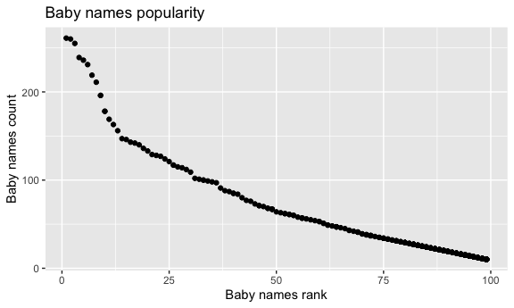

p8105\_hw2\_hz2710
================
Huili Zheng
10/7/2021

## Problem 1

Read and clean the Mr. Trash Wheel sheet:

``` r
wheel_df = 
  read_excel("data/Trash-Wheel-Collection-Totals-7-2020-2.xlsx",range = "A2:N535" ) %>%
  janitor::clean_names() %>%
  drop_na("dumpster") %>%
  mutate(
    sports_balls = round(sports_balls)
  ) 
```

Read and clean precipitation data for 2018 and 2019.

``` r
pre2018_df = 
  read_excel("data/Trash-Wheel-Collection-Totals-8-6-19.xlsx",
             sheet = "2018 Precipitation",
             range = "A2:B14") %>%
  janitor::clean_names() %>%
  drop_na("total") %>%
  mutate(
    year = 2018
  )
pre2019_df = 
  read_excel("data/Trash-Wheel-Collection-Totals-8-6-19.xlsx",
             sheet = "2019 Precipitation",
             range = "A2:B14") %>%
  janitor::clean_names() %>%
  drop_na("total") %>%
  mutate(
    year = 2019
  )

pre_df = 
  left_join(pre2018_df, pre2019_df, by = "month") %>%
  mutate(
    mouth = month.name[month]
  )
```

The number of observations in Mr.Trash Wheel dataset is 454 and the
number of observations in precipitation data is 12. The key variables of
Mr.Trash Wheel dataset include “weight\_tons” and
“volume\_cubic\_yards”. The key variables of precipitation data are
“month” and “total”. The total precipitation in 2018 is 70.33. The
median number of sports balls in a dumpster in 2019 is 9.

## Problem 2

This problem uses the FiveThirtyEight data; these data were gathered to
create the interactive graphic on this page. In particular, we’ll use
the data in pols-month.csv, unemployment.csv, and snp.csv. Our goal is
to merge these into a single data frame using year and month as keys
across datasets.

First, clean the data in pols-month.csv.

``` r
pols_month_df = 
  read_csv("data/fivethirtyeight_datasets/pols-month.csv") %>%
  janitor::clean_names() %>%
  separate(mon, into = c('year', 'month', 'day'), sep = "-") %>%
  mutate(
    year = as.integer(year),
    month = month.name[as.integer(month)],
    day = as.integer(day),
    president = case_when(prez_gop == 1 ~ "gop" ,
                          prez_dem == 1 ~ "dem"),
  ) %>%
  select(-c(day, prez_dem, prez_gop))
```

    ## Rows: 822 Columns: 9

    ## ── Column specification ────────────────────────────────────────────────────────
    ## Delimiter: ","
    ## dbl  (8): prez_gop, gov_gop, sen_gop, rep_gop, prez_dem, gov_dem, sen_dem, r...
    ## date (1): mon

    ## 
    ## ℹ Use `spec()` to retrieve the full column specification for this data.
    ## ℹ Specify the column types or set `show_col_types = FALSE` to quiet this message.

Second, clean the data in snp.csv using a similar process to the above.

``` r
snp_df = 
  read_csv("data/fivethirtyeight_datasets/snp.csv") %>%
  janitor::clean_names() %>%
  mutate(date = mdy(date)) %>%
  separate(date, into = c('year', 'month', 'day'),sep = "-") %>%
  mutate(
    year = as.integer(year),
    month = month.name[as.integer(month)],
  ) %>%
  relocate(year, month) %>%
  select(-(day))
```

    ## Rows: 787 Columns: 2

    ## ── Column specification ────────────────────────────────────────────────────────
    ## Delimiter: ","
    ## chr (1): date
    ## dbl (1): close

    ## 
    ## ℹ Use `spec()` to retrieve the full column specification for this data.
    ## ℹ Specify the column types or set `show_col_types = FALSE` to quiet this message.

Third, tidy the unemployment data so that it can be merged with the
previous datasets.

``` r
unemployment_df = 
  read.csv("data/fivethirtyeight_datasets/unemployment.csv") %>%
  janitor::clean_names() %>%
  pivot_longer(jan:dec, names_to = "month", values_to = "unemployment rate") %>%
  mutate(
    month = case_when(month == "jan" ~ "1",
                      month == "feb" ~ "2",
                      month == "mar" ~ "3",
                      month == "apr" ~ "4",
                      month == "may" ~ "5",
                      month == "jun" ~ "6",
                      month == "jul" ~ "7",
                      month == "aug" ~ "8",
                      month == "sep" ~ "9",
                      month == "oct" ~ "10",
                      month == "nov" ~ "11",
                      month == "dec" ~ "12"),
    month = month.name[as.integer(month)]
  )
```

Join the datasets by merging snp into pols, and merging unemployment
into the result.

``` r
result_df = left_join(left_join(snp_df,pols_month_df,by = c("year","month")), unemployment_df, by = c("month","year"))
```

The pols-month dataset contains the number of governors, senators,
representatives from republican and democratic parties from 1947 to 2015
and specifies the party the presidents were on the associated date. The
snp dataset contains the closing value of the S&P stock index on the
associated date. The unemployment dataset contains the every month
unemployment rate in the associated year. The dimension of result
dataset is 787 rows and 11 columns. The range of years is -99, the names
of key variables are “year” and “month”.

## Problem3

This problem uses data from NYC Open data on the popularity of baby
names.

Load and tidy the data. Address the problems of the names of a
categorical predictor and the case structure of string variables.

``` r
pop_name = 
  read_csv("data/Popular_Baby_Names.csv") %>%
  janitor::clean_names() %>%
  mutate(
    childs_first_name = str_to_lower(childs_first_name),
    gender = str_to_lower(gender),
    ethnicity = str_to_lower(ethnicity)
  ) %>%
  distinct()
```

    ## Rows: 19418 Columns: 6

    ## ── Column specification ────────────────────────────────────────────────────────
    ## Delimiter: ","
    ## chr (3): Gender, Ethnicity, Child's First Name
    ## dbl (3): Year of Birth, Count, Rank

    ## 
    ## ℹ Use `spec()` to retrieve the full column specification for this data.
    ## ℹ Specify the column types or set `show_col_types = FALSE` to quiet this message.

``` r
count(pop_name, ethnicity)
```

    ## # A tibble: 7 × 2
    ##   ethnicity                      n
    ##   <chr>                      <int>
    ## 1 asian and paci               358
    ## 2 asian and pacific islander  1782
    ## 3 black non hisp               353
    ## 4 black non hispanic          1833
    ## 5 hispanic                    3564
    ## 6 white non hisp               701
    ## 7 white non hispanic          3590

``` r
pop_name = pop_name %>%
  mutate(
    childs_first_name = str_to_title(childs_first_name),
    ethnicity = case_when(
      ethnicity == "asian and paci" ~ "asian and pacific islander",
      ethnicity == "black non hisp" ~ "black non hispanic",
      ethnicity == "white non hisp" ~ "white non hispanic",
      ethnicity == "asian and pacific islander" ~ "asian and pacific islander",
      ethnicity == "black non hispanic" ~ "black non hispanic",
      ethnicity == "white non hispanic" ~ "white non hispanic",
      ethnicity == "hispanic" ~ "hispanic")
  )
```

Produce a table showing the rank in popularity of the name “Olivia” as a
female baby name over time.

``` r
olivia_df = 
  pop_name %>%
  filter(childs_first_name == "Olivia", gender == "female") %>%
  select(year_of_birth, ethnicity,rank) %>%
  pivot_wider(names_from = year_of_birth, values_from = rank) %>%
  knitr::kable()

olivia_df
```

| ethnicity                  | 2016 | 2015 | 2014 | 2013 | 2012 | 2011 |
|:---------------------------|-----:|-----:|-----:|-----:|-----:|-----:|
| asian and pacific islander |    1 |    1 |    1 |    3 |    3 |    4 |
| black non hispanic         |    8 |    4 |    8 |    6 |    8 |   10 |
| hispanic                   |   13 |   16 |   16 |   22 |   22 |   18 |
| white non hispanic         |    1 |    1 |    1 |    1 |    4 |    2 |

Investigate the most popular name over time among male babies.

``` r
## find the most popular male name
male_name_df = 
  pop_name %>% 
  filter(gender == "male") %>%
  group_by(childs_first_name) %>%
  summarise(frequency = sum(count)) %>%
  arrange(desc(frequency))

## the most popular name among male is ethan.
ethan_df = 
  pop_name %>%
  filter(childs_first_name == "Ethan", gender == "male") %>%
  select(year_of_birth, ethnicity,rank) %>%
  pivot_wider(names_from = year_of_birth, values_from = rank) %>%
  knitr::kable()

ethan_df
```

| ethnicity                  | 2016 | 2015 | 2014 | 2013 | 2012 | 2011 |
|:---------------------------|-----:|-----:|-----:|-----:|-----:|-----:|
| asian and pacific islander |    1 |    2 |    2 |    2 |    2 |    1 |
| black non hispanic         |    5 |    5 |    1 |    1 |    3 |    6 |
| hispanic                   |    7 |    3 |    5 |    5 |    4 |    6 |
| white non hispanic         |   20 |   19 |   18 |   23 |   21 |   26 |

For male, white non-hispanic children born in 2016, produce a scatter
plot showing the number of children with a name (y axis) against the
rank in popularity of that name (x axis).

``` r
M_W_2016 = 
  pop_name %>%
  filter(gender == "male",  year_of_birth == 2016, ethnicity == "white non hispanic")
gg_rank_count = 
  M_W_2016 %>%
  ggplot(aes(x = rank, y = count)) +
  geom_point() +
  labs(
    title = "Baby names popularity",
    x = "Baby names rank",
    y = "Baby names count"
  ) 

gg_rank_count
```



``` r
ggsave("M_W_2016.jpg",gg_rank_count,device = "jpg")
```

    ## Saving 6 x 3.6 in image
